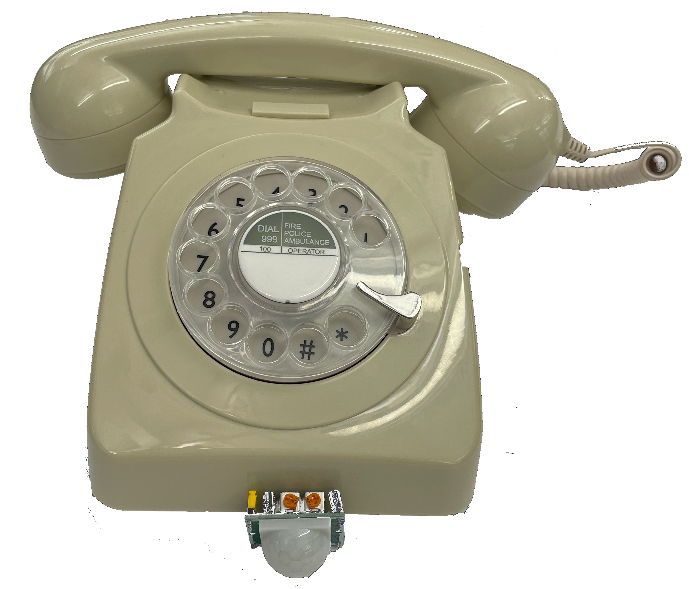
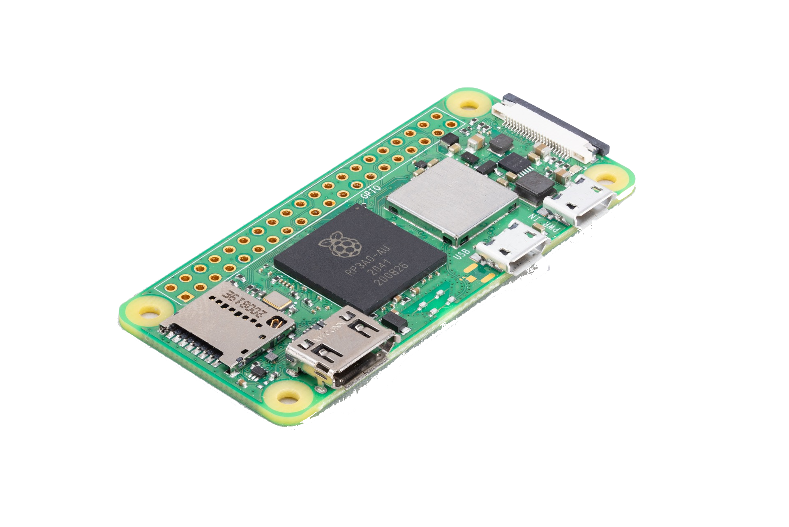

# Project 3 Opposite Telephone

*Adnan Aga, Addison Worthington*

# Intro

It all started when I got a text from a random number. The text said “do you know Taylor Tabb” (the star of the popular Netflix Show Baking Impossible). I had no idea who this number was and texted Taylor that it got this text. He then used this Phone Reverse Lookup app to get the phone to find out who texted me just based off the number!

This made me think 2 things

1. Wow that’s neat!
2. Damn that’s creepy!

How could I create an experience around this idea of letting people know that there are APIs out there that can pull up personal details like their name and age range but also related people and even their address!

Enter the Opposite Telephone

The Opposite Telephone uses publicly available API data to get information about you just based on your phone number. The telephone detects the presence of a user with a PIR sensor and then begins to ring. The "Operator" then prompts you to dial your phone number and then will reveal your name.

## The Build

We wanted to make sure the entire system fit inside our phone which meant opening it up to try and  

We used a Raspberry Pi Zero W 2 as the brains behind our project. This little $15 computer was easily able to handle not just the Python API calls, but also had the GPIO system to be able to interface with the sensors and electronics of the system. We were able to get our whole system together to fit inside the phone itself. 

The other part we needed was a PIR sensor that would detect a person when they got in range. As soon as that happened it would trigger the phone to ring starting the interaction

With these